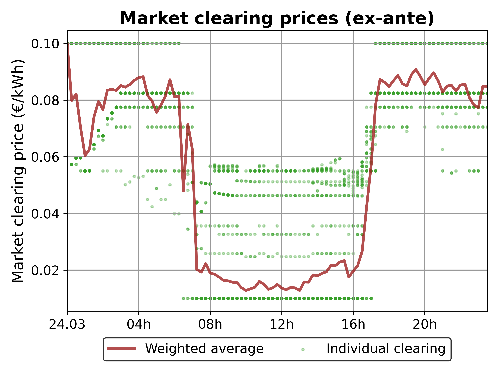
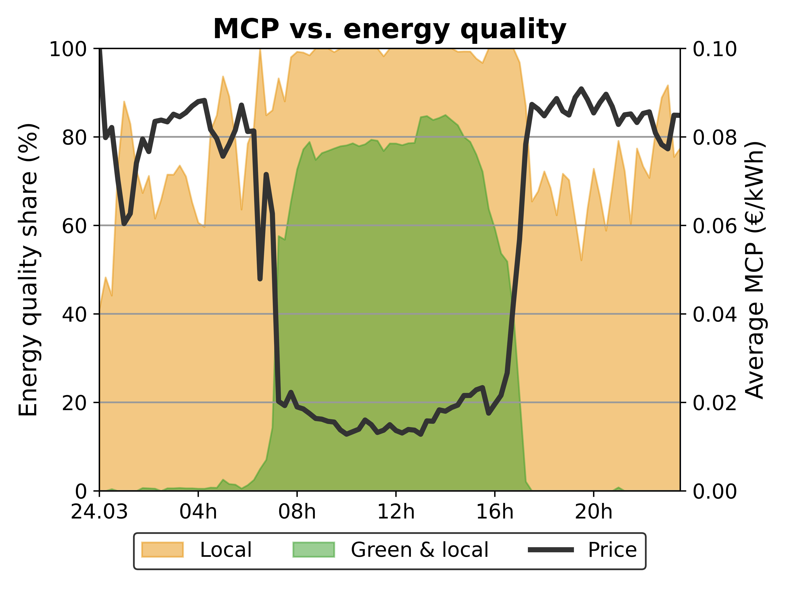
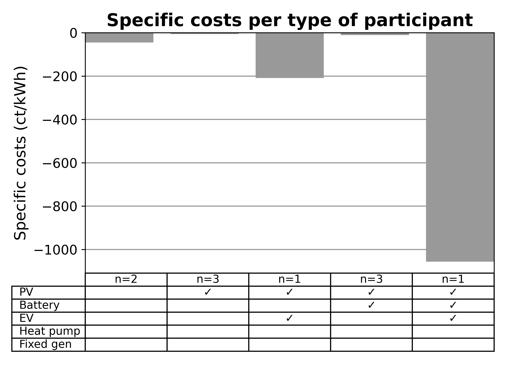

lemlab
=======

An open-source tool for the agent-based development and testing of local energy market applications.

Link to our full [documentation](http://lemlab.readthedocs.io).

NOTE: lemlab is not being actively developed any longer. Its successor HAMLET can be found [here](https://github.com/tum-ens/HAMLET).

## Description

In order to further enable the integration of ever-increasing shares of decentralized electricity generation
and flexible prosumers, local/regional energy markets (LEM) are being investigated as a potential solution to maximize
local matching of generation of consumption in order to relieve pressure on electrical grids by leveraging the inherent
temporal flexibility of the smart prosumer.

Investigating the unique challenges involved in constructing stable and efficient LEMs usually involves the setting up
of complex and extensive simulation environments, the collection of sufficient data and deep technical knowledge of all
components involved. Only then can the desired solution be implemented and tested. Developing software or hardware tools
for deployment in the field typically requires the development of hardware/software-in-the-loop (XiL) development 
environments in order to test prototypes and before field testing can commence.

lemlab was designed specifically with these use cases in mind. lemlab allows the user to simulate a LEM using a full
agent-based modelling (ABM) in either simulation (SIM) or real-time (RTS) modes. This allows the rapid testing of
algorithms as well as the real-time integration of hardware and software components.

lemlab was developed and is maintained by the 
[Chair of Energy Economics and Application Technology](https://www.ei.tum.de/en/ewk/homepage/) of the [Technical
University of Munich](https://www.tum.de/en/). Version 1.0 (May 2021) was developed as part of the research project 
[RegHEE](https://www.ei.tum.de/en/ewk/forschung/projekte/reghee/), funded by the Bavarian Ministry of Economic Affairs, 
Regional Development and Energy. The code base will be upgraded and extended as part of the joint StroM project in 
cooperation with the [Munich School of Engineering](https://www.mse.tum.de/en/home/).

## Features
lemlab offers...
* a fully open-source, agent-based local energy market modelling toolbox
* a modular and extendable design for easy adaptation to your own research questions
* real-time capabilities for the development and testing of hard- and software
* a database-agnostic approach that enables the integration of multiple database technologies
* integrated time-series data for several plant types (household loads, pv, wind, heat pumps, electric vehicles etc...)
* template functionality for load and generation forecasting, trading strategies, cutting-edge market clearing
  algorithms designed specifically for LEMs [paper under review] and much more...

so you only need to adapt the components you want to investigate and/or improve on

## Installation
lemlab is maintained using a combination of PyCharm, PostgreSQL, Gurobi and Anaconda. This installation guide will
explain the procedure for this software combination. It is recommended that beginners follow this guide.

#### Install the following software:
	- PyCharm (Community or Professional)
	- Anaconda Individual Edition
	- PostgreSQL*
	- Gurobi* or CPLEX. GLPK can be used although this is non-ideal.

    *Installation explained later in this README

#### Clone repository
You can download or clone the repository to a local directory of your choice. You can use version control tools such as 
GitHub Desktop, Sourcetree, GitKraken or pure Git. The link for pure Git is: 

`git clone https://github.com/tum-ewk/lemlab.git`

If using PyCharm, clone the repository to `./PyCharmProjects/lemlab/`
###
#### Create a virtual python environment
	- Open the AnacondaPrompt.
	- Type `conda env create -f ./PycharmProjects/lemlab/lemlab-env.yaml`
	- Take care to set the correct (absolute) path to your cloned repository.

#### Activate the environment
	- Open PyCharm
	- Go to 'File->Open'
	- Navigate to PyCharmProjects and open lemlab
	- When the project has opened, go to 
         `File->Settings->Project->Python Interpreter->Show all->Add->Conda Environment
          ->Existing environment->Select folder->OK`

#### Install a solver (we recommend Gurobi)
	- Go to gurobi.com
	- Create an account with your university email
	- When the account has been activated, log in and download the newest Gurobi solver.
	- Go to Academia->Academic Program and Licenses
	- Follow the installation instructions under "Individual Academic Licenses" to activate your copy of Gurobi

### Install and configure PostgreSQL
	- Install PostgreSQL from https://www.postgresql.org/
    - if possible, select port 5432. If this is not possible, you will need to edit the configuration file
      before executing any simulations
	- When your installation has been completed, launch pgAdmin 4
	- Select your local server (PostgreSQL 13)
	- Open Login/Group Roles and create two new login roles as follows
		1. name: admin_lem
		   password: admin
		   privileges: can login
		               superuser
		2. name: market_participant
		   password: user
		   privileges: can login

### Test your installation
    - navigate to ./PycharmProjects/lemlab/code_examples
	- execute sim_1_create_scenario.py, followed by sim_3_run.py
    - When the simulation has completed (this may take some time, depending on your system), 
      analyze the results by executing sim_4_plot_results.py
	- Look at the output plots under lemlab/simulation_results/test_sim/analyzer/

Your installation was successful if you see plots similar to the following:

.png)

.png)

## Contact
Feel free to contact us if you want to contribute to this project, cooperate on an interesting research question
or just to ask about the project.

[Sebastian Dirk Lumpp](https://www.ei.tum.de/en/ewk/staff/scientific-staff/sebastian-dirk-lumpp/)  
sebastian.lumpp@tum.de  
Research Associate @ TUM EWK

## References
#### Original Platform Paper:
&nbsp;&nbsp;&nbsp;&nbsp; Holistic Design of Local Energy Markets: the lemlab Simulation and Testing Toolbox  
&nbsp;&nbsp;&nbsp;&nbsp;&nbsp;&nbsp;Sebastian Dirk Lumpp, Michel Zade, Markus Doepfert, Peter Tzscheutschler  
&nbsp;&nbsp;&nbsp;&nbsp;&nbsp;&nbsp;In Progress

#### Market matching algorithms:
&nbsp;&nbsp;&nbsp;&nbsp;[Satisfying user preferences in community-based local energy markets — Auction-based clearing approaches](https://doi.org/10.1016/j.apenergy.2021.118004)  
&nbsp;&nbsp;&nbsp;&nbsp;Michel Zade, Sebastian Dirk Lumpp, Peter Tzscheutschler, Ulrich Wagner  
&nbsp;&nbsp;&nbsp;&nbsp;Applied Energy, 2022

#### Blockchain implementation of a LEM:
&nbsp;&nbsp;&nbsp;&nbsp;[Evaluating the added value of blockchains to local energy markets—Comparing the performance of blockchain-based and centralised implementations](https://doi.org/10.1049/stg2.12058)  
&nbsp;&nbsp;&nbsp;&nbsp;Michel Zade, Marcello Feroce, Arturo Guridi, Sebastian Dirk Lumpp, Peter Tzscheutschler  
&nbsp;&nbsp;&nbsp;&nbsp;IET Smart Grid, 2022

## License

Copyright (C) 2022 TUM-EWK

This program is free software: you can redistribute it and/or modify
it under the terms of the GNU General Public License as published by
the Free Software Foundation, either version 3 of the License, or
(at your option) any later version.

This program is distributed in the hope that it will be useful,
but WITHOUT ANY WARRANTY; without even the implied warranty of
MERCHANTABILITY or FITNESS FOR A PARTICULAR PURPOSE.  See the
GNU General Public License for more details.

You should have received a copy of the GNU General Public License
along with this program.  If not, see <https://www.gnu.org/licenses/>.
