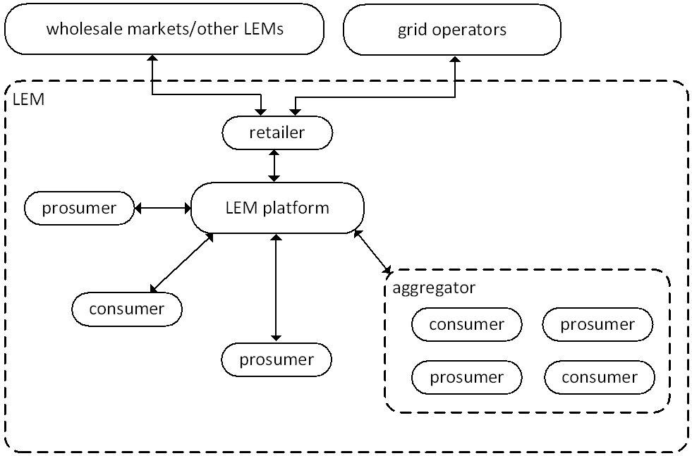
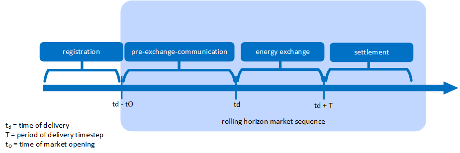
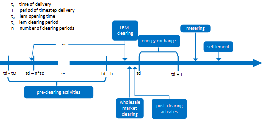

Introduction to LEMs
====================
This chapter's purpose is to familiarize the user with what local energy markets (LEMs) actually are, how they work,
who the participants are and basic terminology used in this research area.

The why and what of LEMs
------------------------

The fundamental goal of markets is to efficiently match supply and the demand. While the definition of "efficiency" may
vary, energy markets share this goal. Traditional energy markets are usually implemented on national levels. The
transmission of electricity is treated as an entirely separate task in European liberalized markets. These traditional
systems are facing challenges in the face of the rapid expansion of distributed energy resources (often in the form of
fluctuating renewables) as well as the anticipated electrification of the mobility and heat sectors in the form of
electric vehicles and heat pumps.

The European Union has included new rules in its "Directive on common rules for the internal electricity market" ((EU)
2019/944) "that enable active consumer participation, individually or through citizen energy communities, in all
markets, either by generating, consuming, sharing or selling  electricity, or by providing flexibility services through
demand-response and storage.  The directive aims to improve the uptake of energy communities and make it easier for
citizens to integrate efficiently in the electricity system, as active participants."

Specifically, the aim of these energy communities is to enable decentralized producers and consumers (prosumers) to
participate "on equal footing with large participants".

There is no doubt that developing local energy markets and effectively integrating these into existing structures
presents a major engineering challenge. In addition to questions of market design, social welfare, and regulation,
technical questions regarding infrastructure, organization, agent strategies, market gaming, price formation and many
more threaten to overwhelm designers.

In order to tackle the challenges faced by engineers, designers, and regulators, we present the local energy market
laboratory, **lemlab**, an open-source tool for the agent-based development and testing of local energy market
applications.

What does a LEM look like?
--------------------------
There is as yet no consensus on what the best structure for a LEM is. For this reason we have attempted to keep our
architecture as generic as possible in order to allow the user maximal flexibility in the system designs they wish to
implement.

We begin by explaining the basic structure of a LEM according to *lemlab*:

At the heart of the *lemlab* is the **prosumer**. In modern power systems, the end user is no longer just a consumer.
The prosumer is the generalized market participant, combining production, consumption, and flexibility with a
preference for local and sustainable energy. Of course a prosumer could be a pure consumer, a simple producer, they
might be entirely inflexible or they might prefer their electrical energy sources to produce as much carbon dioxide as
possible. In any case, we will still refer to them as a prosumer.

Prosumers place bids on a **LEM platform**. This platform combines all market functionality, beginning with user
management, bid/offer collection and clearing, and ending with meter reading collection, market settlement and levy
collection. **Aggregators** trade on a LEM on behalf of a group of prosumers. **Retailers** take care of coupling the
LEM to the wholesale market.

That's pretty much it. Of course we can also model grid operators, transmission grids and wholesale markets as well
as multiple LEMs. These are possible in *lemlab* and some are covered in this documentation. All are simply a matter of
rearranging the building blocks *lemlab* supplies to construct the desired system.

When does what happen in a LEM?
-------------------------------
Similarly to LEM structure, there is no general consensus on the timeline of events in a LEM. We present here a, in our
opinion, sensible timeline for a local energy market, based loosely on the general principles underlying European
electricity markets.

We divide our market timeline into four fundamental time periods. The first is **registration**, which takes place
before trading commences. We then enter the **rolling horizon market sequence**, which repeats for each delivery period.
Each day is divided into an arbitrary number of periods of energy exchange, referred to as **timestep of delivery**
(ts_delivery) labelled as the period between td and td + T. We usually use 15 minute windows (T=900s), as the German
electricity market is divided into 15 minute periods. During this time, the physical flow of energy takes place. All
other activities either take place between market opening, td - tO, and the beginning of the ts_delivery in question,
td, and are known as **pre-exchange-activities**, or they take place after delivery, in which case they are known as
**settlement** activities. Examples of pre-exchange activities are forecasting of demand and energy trading, while
settlement activites include meter value logging, market settlement and balancing energy settlement.

The above figure shows a slightly more detailed timeline. We see pre-clearing activities taking place during each of *n*
clearing periods before the timestep of energy delivery. Market clearing can take place during some or all of these
periods. Post-clearing activities take place after clearing but before delivery and typically include the checking of
clearing results. Metering and settlement activities are performed after the period of energy delivery is complete.

For a more detailed look into the construction of lemlab and the individual agents, please see chapters 3 and 4.

Basic terminology
-----------------

+--------------------------+----------------------------------------------------------------------------------------------------------+
| agent                    | someone participating in the LEM                                                                         |
+--------------------------+----------------------------------------------------------------------------------------------------------+
| aggregator               | an agent trading on behalf of several other agents                                                       |
+--------------------------+----------------------------------------------------------------------------------------------------------+
| LEM                      | local energy market                                                                                      |
+--------------------------+----------------------------------------------------------------------------------------------------------+
| pre-clearing activities  | activities taking place before market clearing, e.g. forecasting and trading                             |
+--------------------------+----------------------------------------------------------------------------------------------------------+
| pre-exchange activities  | activities taking place before energy exchange, e.g. forecasting, trading, and checking clearing results |
+--------------------------+----------------------------------------------------------------------------------------------------------+
| post-clearing activities | activities taking place before energy exchange but after market clearing, e.g. checking clearing results |
+--------------------------+----------------------------------------------------------------------------------------------------------+
| prosumer                 | an agent with production and/or consumption, participating the in the LEM                                |
+--------------------------+----------------------------------------------------------------------------------------------------------+
| registration             | the first step in participating in a LEM                                                                 |
+--------------------------+----------------------------------------------------------------------------------------------------------+
| retailer                 | an agent who couples the LEM with the wholesale markets                                                  |
+--------------------------+----------------------------------------------------------------------------------------------------------+
| settlement               | activities taking place after market clearing, e.g. market settlement and balancing settlement           |
+--------------------------+----------------------------------------------------------------------------------------------------------+
