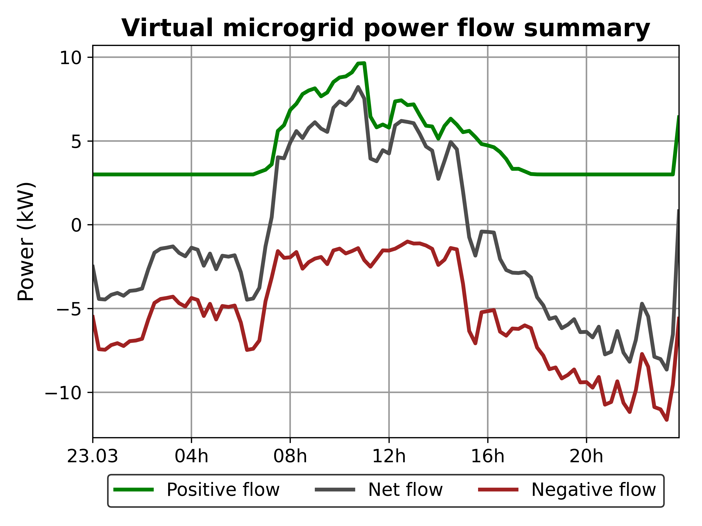
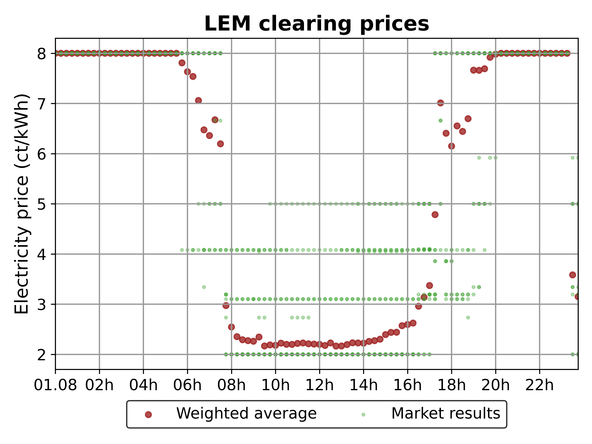
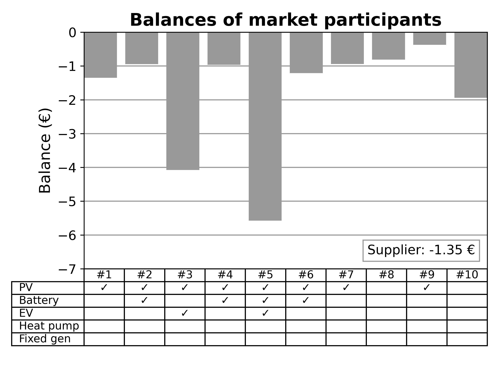
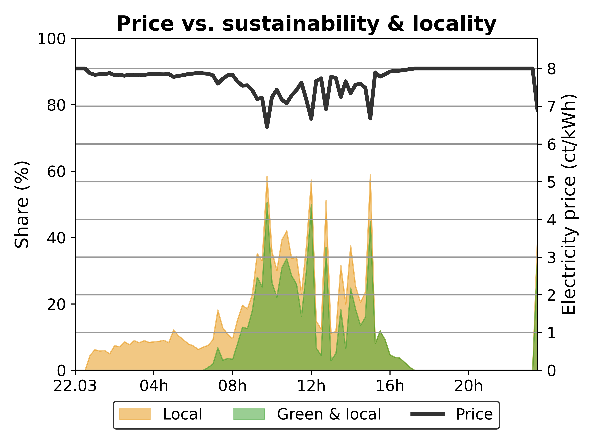
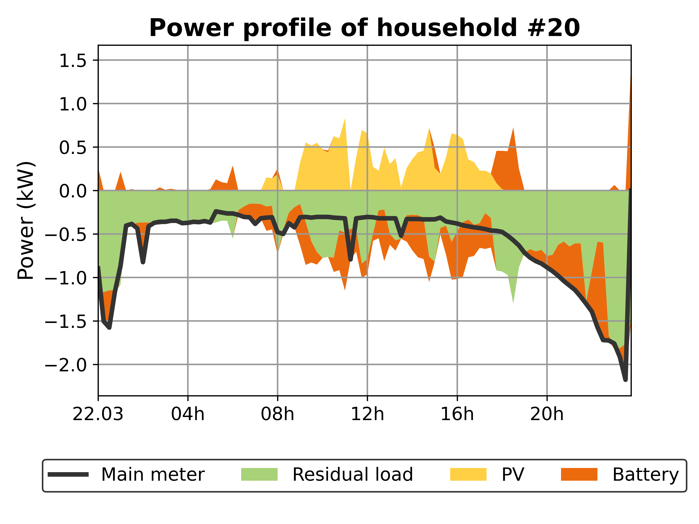
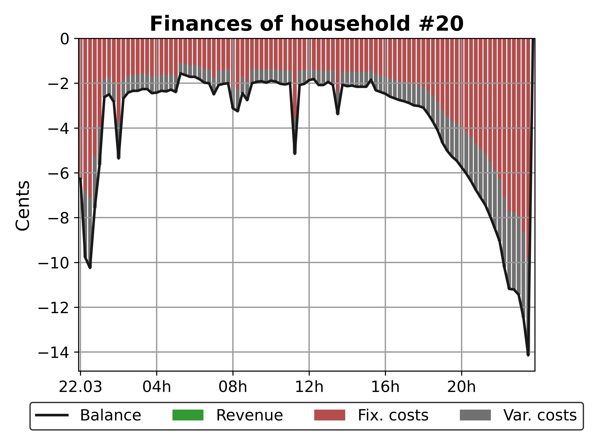

===========================
Getting started with lemlab
===========================

General
=======
In order to further enable the integration of ever-increasing shares of decentralized electricity generation and
flexible prosumers, local/regional energy markets (LEM) are being investigated as a potential solution to maximize
local matching of generation of consumption in order to relieve pressure on electrical grids by leveraging the
inherent temporal flexibility of the smart prosumer.

Investigating the unique challenges involved in constructing stable and efficient LEMs usually involves the setting up
of complex and extensive simulation environments, the collection of sufficient data and deep technical knowledge of all
components involved. Only then can the desired solution be implemented and tested. Developing software or hardware tools
for deployment in the field typically requires the development of hardware/software-in-the-loop (XiL) development
environments in order to test prototypes and before field testing can commence.

lemlab was designed specifically with these use cases in mind. lemlab allows the user to simulate a LEM using a full
agent-based modelling (ABM) in either simulation (SIM) or real-time (RTS) modes. This allows the rapid testing of
algorithms as well as the real-time integration of hardware and software components.

Installation guide
==================

lemlab is maintained using a combination of PyCharm, PostgreSQL, Gurobi and Anaconda. This installation guide will
explain the procedure for this software combination. It is recommended that beginners follow this guide.

**Install the following software**

    - PyCharm (Community or Professional)
    - Anaconda Individual Edition
    - PostgreSQL*
    - Gurobi* or CPLEX. GLPK can be used although this is non-ideal.

**Clone repository**
You can download or clone the repository to a local directory of your choice. You can use version control tools such as
GitHub Desktop, Sourcetree, GitKraken or pure Git. The link for pure Git is:

``git clone https://github.com/tum-ewk/lemlab.git``

If using PyCharm, clone the repository to `./PyCharmProjects/lemlab/`

**Create a virtual python environment**
    - Open the AnacondaPrompt.
    - Type `conda env create -f ./PycharmProjects/lemlab/lemlab-env.yaml`
    - Take care to set the correct (absolute) path to your cloned repository.

**Activate the environment**
    - Open PyCharm
    - Go to 'File->Open'
    - Navigate to PyCharmProjects and open lemlab
    - When the project has opened, go to
        `File->Settings->Project->Python Interpreter->Show all->Add->Conda Environment->Existing environment->Select folder->OK``

**Install a solver (we recommend Gurobi)**
    - Go to gurobi.com
    - Create an account with your university email
    - When the account has been activated, log in and download the newest Gurobi solver.
    - Go to Academia->Academic Program and Licenses
    - Follow the installation instructions under "Individual Academic Licenses" to activate your copy of Gurobi

**Install and configure PostgreSQL**
    - Install PostgreSQL from https://www.postgresql.org/
    - if possible, select port 5432. If this is not possible, you will need to edit the configuration file
      before executing any simulations
    - When your installation has been completed, launch pgAdmin 4
    - Select your local server (PostgreSQL 13)
    - Open Login/Group Roles and create two new login roles as follows
        1. name: admin_lem
            password: admin
            privileges: can login
                        superuser
        2. name: market_participant
            password: user
            privileges: can login

Test your installation
======================
    - navigate to ./PycharmProjects/lemlab/code_examples
    - execute sim_1_create_scenario.py, followed by sim_3_run.py
    - When the simulation has completed (this may take some time, depending on your system),
      analyze the results by executing sim_4_plot_results.py
    - Look at the output plots under lemlab/simulation_results/test_sim/analyzer/

Your installation was successful if you see plots similar to the following:

Structure
=========

Workflow
========

Input Data
==========

.. _OPEN - An open-source platform for developing smart local energy system applications: https://www.researchgate.net/publication/342849801_OPEN_An_open-source_platform_for_developing_smart_local_energy_system_applications
.. _tool: https://www.smartdraw.com/workflow-diagram/examples/ecommerce-workflow-diagram/